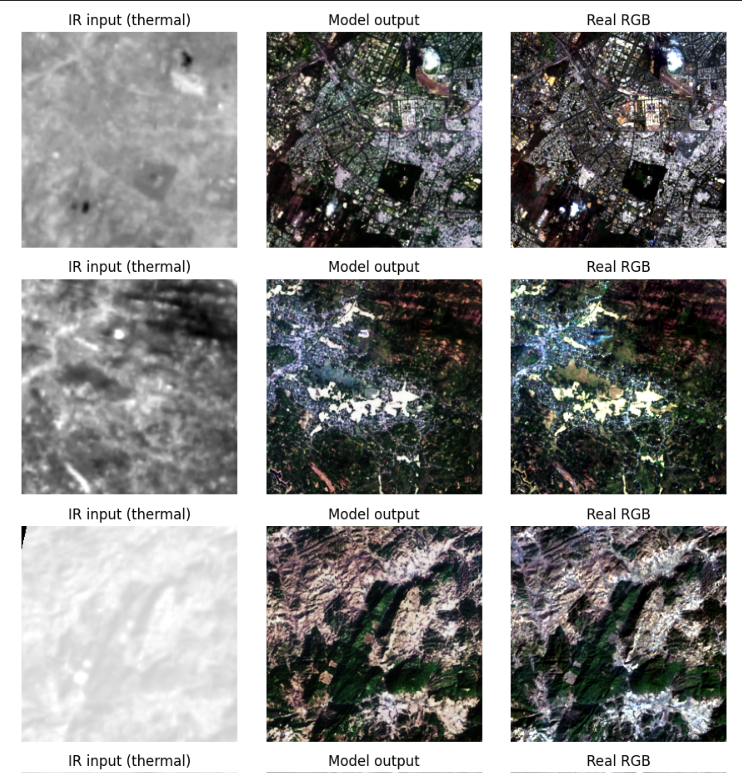
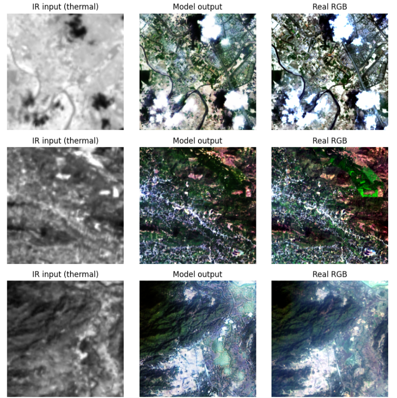
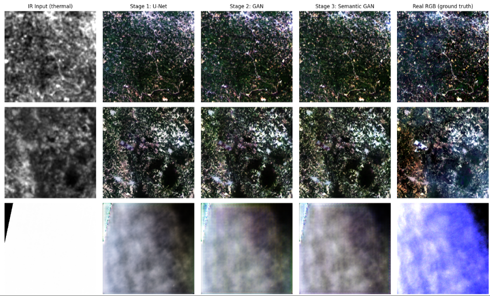
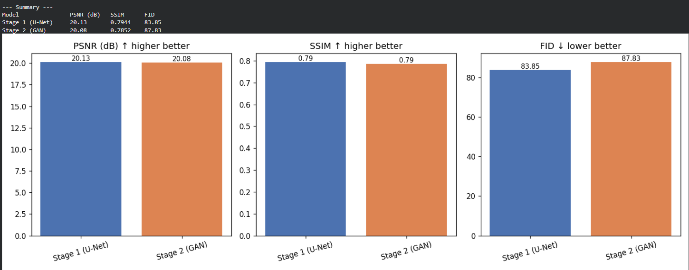
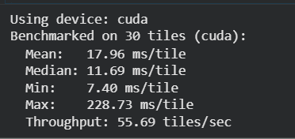

# Infrared Image Colorization & Enhancement for Improved Object Interpretation

A Generative AI pipeline that takes multi-band infrared/thermal satellite imagery (Landsat 8/9) and produces realistically colorized, high-fidelity RGB imagery — improving human and machine interpretability of satellite scenes captured at night or through infrared sensing.

Built as a staged Pix2Pix-style conditional GAN, progressively refined across three training stages, with a physically-grounded semantic constraint to reduce color hallucination.

---

## Problem Statement

Satellite remote sensing frequently relies on infrared (IR) sensors for night-time or adverse-weather imaging, but raw IR is monochrome, low-contrast, and hard to interpret — for both human analysts and downstream computer vision pipelines. This project builds an end-to-end framework that colorizes and enhances IR satellite imagery into realistic RGB, without introducing artifacts or misrepresenting ground truth.

---

## Approach

Rather than a single generic image-to-image model, this pipeline exploits a key fact about Landsat 8/9: the thermal and multispectral sensors are on the same platform, same pass, same footprint — meaning real, pixel-aligned RGB ground truth is available for supervised training, not just unpaired domain transfer.

### Input representation
Instead of a single grayscale thermal band, the model takes a **4-channel stack**: Thermal (B10) + NIR (B5) + SWIR1 (B6) + SWIR2 (B7) — using near-infrared and shortwave-infrared bands to disambiguate land-cover signatures that look similar in thermal alone (e.g. warm rooftops vs. bare soil).

### Staged training
| Stage | Description | Purpose |
|---|---|---|
| **1. Baseline U-Net** | Encoder-decoder with skip connections, trained with L1 + SSIM loss | Learn structurally accurate, roughly-correct colors |
| **2. GAN (PatchGAN)** | Adds an adversarial discriminator (70×70 patch-level realism) | Sharpen texture, push toward vivid/realistic color |
| **3. Semantic-Constrained GAN** | Adds a physically-grounded consistency loss using NDVI/NDWI computed from real spectral bands | Enforce vegetation=green, water=blue regardless of what the discriminator considers "realistic" — directly targets hallucination prevention |

Each stage warm-starts from the previous stage's best checkpoint.

---

## Project Structure

```
project/
├── data/
│   ├── raw/<scene_id>/        # Landsat bands: B2,B3,B4,B5,B6,B7,B8,B10 (not committed to git)
│   └── processed/             # Tiled .npz files (256x256), ready for training (not committed to git)
├── notebooks/                 # Colab exploration notebooks
├── src/
│   ├── dataset.py                     # Band loading, NDVI/NDWI/NDBI computation, tiling, PyTorch Dataset
│   ├── model.py                       # U-Net generator + PatchGAN discriminator
│   ├── train.py                       # Stage 1: baseline U-Net training (L1 + SSIM)
│   ├── train_gan.py                   # Stage 2: adversarial training (+ PatchGAN)
│   ├── train_gan_semantic.py          # Stage 3: adversarial + semantic consistency loss
│   ├── eval.py                        # PSNR / SSIM / FID on held-out validation tiles
│   ├── plot_eval_comparison.py        # Bar-chart comparison of eval metrics across stages
│   ├── downstream_detection_test.py   # YOLOv8 detection comparison: raw IR vs colorized vs real RGB
│   ├── quick_inference_check.py       # Quick visual sanity-check grid (IR | output | real RGB)
│   ├── full_pipeline_comparison.py    # All 3 stages side by side, for presentation
│   └── inference.py                   # Standalone single-tile inference + timing benchmark
├── checkpoints/                # Model weights (not committed to git; stored on Google Drive)
└── outputs/                    # Generated images, comparison grids, eval results (not committed to git)
```

---

## Setup

```bash
pip install -r requirements.txt
```

Core dependencies: `torch`, `torchvision`, `rasterio`, `numpy`, `opencv-python`, `scikit-image`, `matplotlib`, `pytorch-fid`, `ultralytics`.

### Data acquisition
Landsat 8/9 Level-1 scenes were sourced from USGS EarthExplorer / LandsatLook, covering multiple Indian locations across varied terrain (urban, water, vegetation), with cloud cover below ~1%. For each scene, bands `B2, B3, B4, B5, B6, B7, B8, B10` are required, organized as:

```
data/raw/<scene_id>/
    B2.TIF   B3.TIF   B4.TIF   B5.TIF
    B6.TIF   B7.TIF   B8.TIF   B10.TIF
```

### Preprocessing (tiling)
```bash
python src/dataset.py --raw_dir data/raw --processed_dir data/processed --tile_size 256 --stride 256
```
This loads all bands per scene, computes NDVI/NDWI/NDBI indices, and tiles each scene into 256×256 `.npz` patches. Blank/near-constant edge tiles and RGB contrast/haze correction are handled automatically at load time in `IRColorizationDataset` (no re-tiling needed if normalization logic changes).

---

## Training

Training was run on Google Colab (T4 GPU), with data and checkpoints synced via Google Drive.

**Stage 1 — Baseline U-Net:**
```bash
python src/train.py \
  --processed_dir data/processed --checkpoint_dir checkpoints --output_dir outputs \
  --epochs 25 --batch_size 8
```



**Stage 2 — GAN (warm-started from Stage 1):**
```bash
python src/train_gan.py \
  --processed_dir data/processed --checkpoint_dir checkpoints --output_dir outputs \
  --init_from checkpoints/best_model.pth --epochs 30 --batch_size 8
```



**Stage 3 — Semantic-Constrained GAN (warm-started from Stage 2):**
```bash
python src/train_gan_semantic.py \
  --processed_dir data/processed --checkpoint_dir checkpoints --output_dir outputs \
  --init_from checkpoints/best_gan_generator.pth --epochs 20 --batch_size 8
```



---

## Evaluation

```bash
python src/eval.py --processed_dir data/processed --checkpoint <path> --output_dir outputs --tag <label>
python src/plot_eval_comparison.py --results outputs/eval_results_*.json --labels "Stage 1" "Stage 2" --output outputs/eval_comparison.png
python src/downstream_detection_test.py --processed_dir data/processed --checkpoint <path> --output_dir outputs
python src/full_pipeline_comparison.py --processed_dir data/processed --ckpt_stage1 <p1> --ckpt_stage2 <p2> --ckpt_stage3 <p3> --output outputs/full_pipeline_comparison.png
python src/inference.py --checkpoint <path> --processed_dir data/processed --benchmark_n 30
```

### Results (held-out validation set, 205 tiles)

| Model | PSNR (dB) ↑ | SSIM ↑ | FID ↓ |
|---|---|---|---|
| Stage 1: U-Net (L1+SSIM) | 20.13 | 0.7944 | 83.85 |
| Stage 2: GAN | 20.08 | 0.7852 | 87.83 |



**Note on interpretation:** Stage 2 shows a small dip in PSNR/SSIM/FID relative to Stage 1. This is a known, expected tradeoff in adversarial image translation — L1/SSIM reward "safe," averaged pixel matching, while the GAN intentionally trades some of that for sharper, more vivid, perceptually realistic texture and color (visible clearly in qualitative comparisons). At only 205 evaluation tiles, FID in particular is noisy (commonly computed on 10,000+ images in literature) — the gap here is within plausible measurement noise.

### Inference performance (Colab T4 GPU)
- **Mean: 17.96 ms/tile** (median 11.69 ms/tile)
- **Throughput: ~55.7 tiles/sec**



### Qualitative / visual inspection
Full pipeline comparison grids (thermal → Stage 1 → Stage 2 → Stage 3 → real RGB) confirm strong structural and color accuracy across most terrain types (urban road networks, forest/mountain texture, river paths, cloud shapes) with no fabricated objects observed in the majority of test tiles.

**Known limitation:** the model occasionally underperforms on strongly saturated water/cloud-heavy regions (observed producing a pale grey/hazy output instead of vivid blue in one test tile), particularly near scene edges. This is a plausible direction for future work — e.g., incorporating explicit cloud masking or a larger, more diverse training set.

---

## Downstream Task Test

A pretrained YOLOv8 (COCO-pretrained, inference only — no additional training) was run on three versions of held-out tiles: raw IR (thermal replicated to 3-channel), colorized model output, and real RGB, comparing detection count and confidence as a proxy for "how much recognizable structure a standard CV pipeline can extract" from each representation.

---

## Roadmap / Status

- [x] Data acquisition (Landsat 8/9, multiple Indian locations, varied terrain)
- [x] Preprocessing (tiling, NDVI/NDWI/NDBI computation, contrast correction)
- [x] Stage 1: Baseline U-Net
- [x] Stage 2: GAN (PatchGAN discriminator)
- [x] Stage 3: Semantic constraint loss
- [x] Evaluation (PSNR / SSIM / FID)
- [x] Downstream object detection comparison
- [x] Inference benchmarking
- [ ] Sharpening/enhancement module using panchromatic band (B8) — not yet implemented
- [ ] Web-based interactive demo

---

## Known Limitations & Future Work

- Trained on a small number of scenes (limited scene diversity may affect generalization to unseen geographies)
- Panchromatic band (B8) currently unused — a dedicated sharpening module (pansharpening-guided) is a planned extension for the "enhancement" half of the problem statement
- Occasional color inaccuracy on strongly saturated water/cloud regions (see above)
- YOLOv8 used for downstream testing is COCO-pretrained (everyday objects), not satellite-domain-specific — results are a structural-recognizability proxy rather than literal object-class detection accuracy

---

© 2026 Infrared Image Colorization Project. All rights reserved.